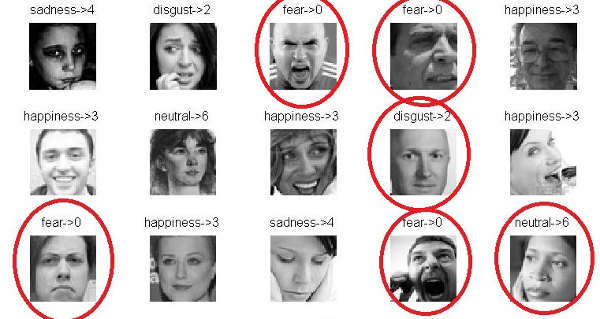
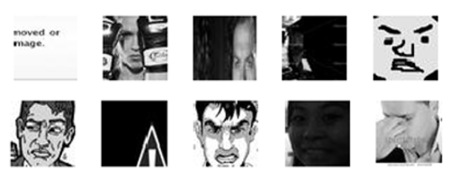
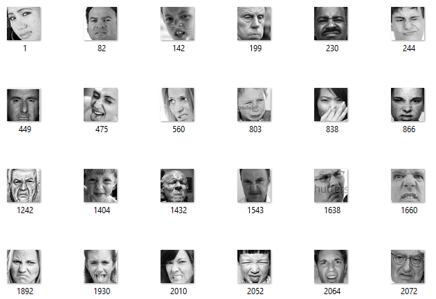

# Human Emotion Analysis

Using a Convolutional Neural Network (CNN) to recognize facial expressions from images or video/camera stream.

# Stage 1

## Steps Involved In the Project:

- Pre-Processing :heavy_check_mark:
- Training
- Evaluating
- Classifcation

## <a>1. Installed dependencies</a>

- Numpy
- Pandas
- Scipy

## <a>2. Dataset Used</a>
- [ferc2013.csv](https://www.kaggle.com/c/challenges-in-representation-learning-facial-expression-recognition-challenge/data)

Fer2013 is a challenging dataset. The images are not aligned and some of them are uncorrectly labeled as we can see from the following images. Moreover, some samples do not contain faces. 

This makes the classification harder because the model have to generalize well and be robust to incorrect data. The best accuracy results obtained on this dataset, as far as I know, is 75.2% described in this paper: 
[[Facial Expression Recognition using Convolutional Neural Networks: State of the Art, Pramerdorfer & al. 2016]](https://arxiv.org/abs/1612.02903)

### <a>Dataset includes:</a>
- Emotion column containg labels as 0,1,2,3,...,6 corresponding to 7 emotions (Angry, Disgust, Fear, Happy, Sad, Surprise and Neutral)
- Pixels column with actual pixel values.
- Usage column with label as Training, PublicTest or PrivateTest.

## <a>3. Tasks Performed</a>
- [Convert From fer2013 to Images](convert_fer2013_to_images_and_landmarks.py)
- The above file extracts data from the dataset fer2013 and stores the image file (.jpg) and numpy array files (.npy) for images and labels to a folder named "fer2013_features" into different subfolders as TestData, TrainingData and PrivateData.
- Following image shows the output of presentation1.

# How To Run:
- Clone the project into a folder
- Download [ferc2013.csv](https://www.kaggle.com/c/challenges-in-representation-learning-facial-expression-recognition-challenge/data)
- Move the csv file in root folder of your project.
- Run command <code>pip install -r requirements.txt</code> 
    <b>Note:</b> Requirements contain requirements for whole project.
- Run <code>python convert_fer2013_to_images_and_landmarks.py</code> 
<i>Recommended: create a virtual environment with python3.6</i>
